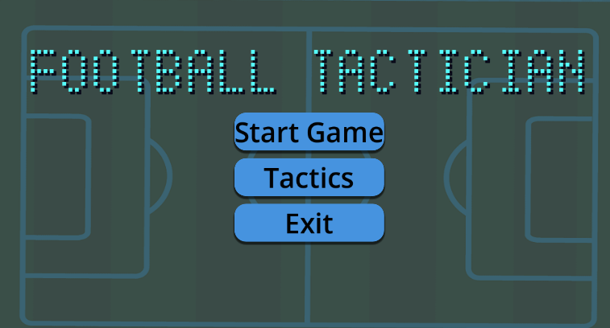
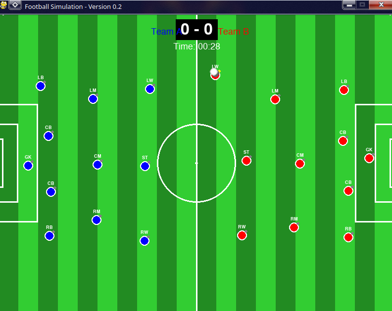

# ⚽ Football Simulation Engine

<p align="center">
  
</p>

<p align="center">
  <strong>A tactical football match simulation engine built with Python and Pygame.</strong>
</p>

<p align="center">
  Simulating football through player intelligence, attributes, positioning, and tactical decision-making.
</p>

---

## 📖 Overview

Football Simulation Engine is a football match simulation project developed using Python and Pygame.

Unlike traditional football games that focus on direct player control, this project focuses on simulating football matches through player attributes, positional awareness, decision-making, and tactical systems.

The long-term vision is to create a complete football simulation framework where teams compete based on their tactical setup, player quality, and strategic decisions.

In future this game is ported to GODOT game engine with better Features and improvement

---

## 🎯 Project Goals

- Simulate realistic football matches
- Create unique player roles and behaviors
- Develop tactical team systems
- Build intelligent AI decision-making
- Generate believable match outcomes
- Lay the foundation for a future Football Manager-style simulation

---

## ✨ Current Features

### ⚽ Match Simulation
- Real-time match visualization using Pygame
- Ball movement system
- Possession mechanics
- Passing logic
- Team interactions

### 👥 Player System
- Individual player objects
- Position-based behavior
- Attribute-driven performance
- Role-specific responsibilities

### 📋 Tactical Foundation
- Formation support
- Positional organization
- Team structure
- Expandable tactical framework

### 🖥️ Visualization
- 2D football pitch rendering
- Real-time player movement
- Ball tracking
- Match event visualization

---

## 🧠 Player Roles

The engine is designed around football-specific player archetypes.

Examples include:

| Role | Description |
|--------|------------|
| Destroyer DM | Wins possession and breaks up attacks |
| Deep Lying Playmaker | Controls tempo from deeper areas |
| Box-to-Box Midfielder | Contributes in attack and defense |
| Advanced Playmaker | Creates chances in attacking zones |
| Target Man | Holds up play and wins aerial duels |
| Poacher | Specializes in finishing chances |
| Inverted Winger | Cuts inside to create and score |
| Ball Playing Defender | Initiates attacks from defense |

Future updates will introduce role-specific AI behavior.

---

## 🏗️ Project Structure

```text
Football-Simulation/

│
├── screenshots/
│
├── src/
│   ├── player.py
│   ├── ball.py
│   ├── formations.py
│   ├── football_game.py
│   └── football_final.py
│
├── requirements.txt
├── README.md
└── .gitignore
```

---

## ⚙️ Technologies Used

| Technology | Purpose |
|------------|----------|
| Python | Core Development |
| Pygame | Visualization & Game Loop |
| Object-Oriented Programming | Simulation Architecture |
| Git | Version Control |

---

## 🚀 Getting Started

### Clone Repository

```bash
git clone https://github.com/sachinchakravarthy/Football-Simulation.git
```

### Navigate into Project

```bash
cd Football-Simulation
```

### Install Dependencies

```bash
pip install pygame
```

### Run the Simulation

```bash
python src/football_game.py
```

---

## 📸 Screenshots

### Match Simulation




---

## 🛣️ Development Roadmap

### Phase 1 — Core Match Engine
- [x] Basic player movement
- [x] Ball movement
- [x] Passing system
- [x] Team structures
- [ ] Advanced passing intelligence
- [ ] Shooting mechanics
- [ ] Goalkeeper behavior

### Phase 2 — Tactical Intelligence
- [ ] Team instructions
- [ ] Pressing systems
- [ ] Defensive shape
- [ ] Counter attacks
- [ ] Possession styles

### Phase 3 — Match Events
- [ ] Goals
- [ ] Assists
- [ ] Fouls
- [ ] Cards
- [ ] Set pieces

### Phase 4 — Advanced Simulation
- [ ] Stamina system
- [ ] Player morale
- [ ] Injuries
- [ ] Player development
- [ ] Match statistics

### Phase 5 — Management Layer
- [ ] Squad management
- [ ] Transfers
- [ ] Training
- [ ] Season simulation
- [ ] League system

---

## 🔬 Technical Concepts

This project explores several concepts:

- Object-Oriented Design
- Game Loops
- State Management
- AI Decision Systems
- Simulation Modeling
- Tactical Football Analysis
- Agent-Based Systems

---

## 💡 Why This Project?

Football is an incredibly complex system involving:

- Spatial reasoning
- Team coordination
- Tactical decision-making
- Probabilistic outcomes
- Human-like behavior

This project serves as an experimental platform to explore how these concepts can be modeled computationally.

---

## 🎓 Learning Outcomes

Through this project I have gained experience with:

- Python Development
- Pygame Framework
- Simulation Design
- Software Architecture
- AI Behavior Systems
- Game Development Fundamentals

---

## 📈 Future Vision

The ultimate goal is to evolve this project into a complete football simulation platform featuring:

- Advanced tactical AI
- Match analysis
- Transfer market
- Player progression
- Multi-season careers
- Manager decision systems

---

## 👨‍💻 Author

**Sachin Chakravarthy U**

B.Tech Computer Science and Engineering (AI & Robotics)  
VIT Chennai

GitHub: https://github.com/sachinchakravarthy

---

## ⭐ Support

If you find this project interesting, consider giving it a star.

Feedback, suggestions, and contributions are always welcome.
